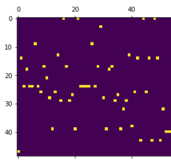
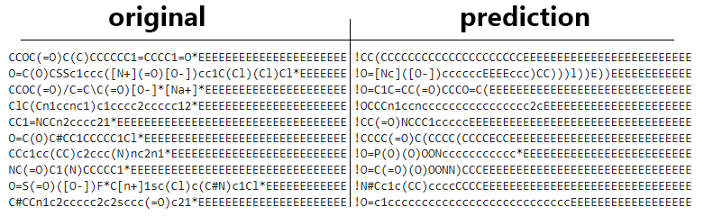

# reaction_ml

Zkouším různé možnosti zakódování molekul:

1) fingerprinty: MACCs, Morganovy
2) Stringy
3) Obrázky:

Tady to je pokus o zakódování reakce ve smiles do obrazku.
Následně jsem zkoušela použít je jako vstup do autoencoderové a LSTM sítě:

Výsledek po 60 generacích, což je málo. Nemyslím si, že by takhle postavená síť někam vyloženě vedla, ale chtěla jsem zkusit co to bude dělat.

4) grafy:
wip

